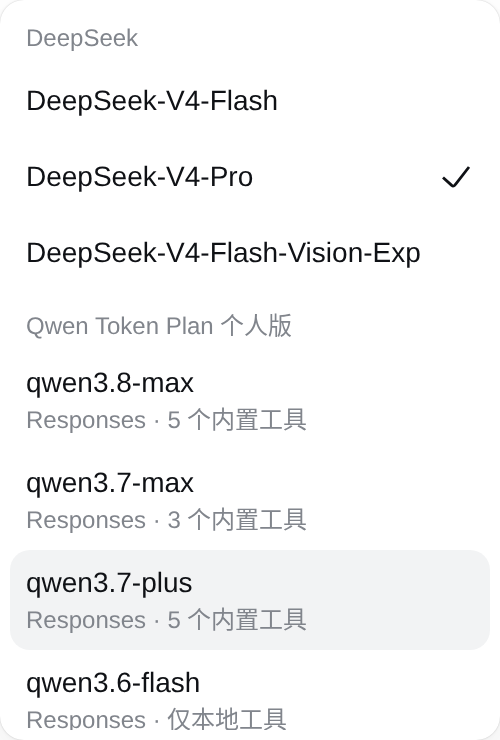

# DSH Plugins

[English](README.en.md) · 简体中文

[](https://github.com/nickhelion/dsh-plugins/actions/workflows/ci.yml)
[](docs/RELEASING.md)
[](https://github.com/topics/dsh-plugin)
[](LICENSE)

面向 [DeepSeek Harness](https://github.com/deepseek-ai/deepseek-harness) 的社区插件 monorepo。每个包保持独立 npm 名称、版本和 `dsh.bundle`，共享同一套开发规范、CI、安全审计与无长期 Token 的发布流程。

## 插件

| 包 | 用途 | 安装 |
| --- | --- | --- |
| [`dsh-qwen-token-plan-cn-responses`](packages/qwen-token-plan-cn-responses) | 千问 Token Plan 个人版 Responses API 模型提供方；同步官方模型/内置工具目录。 | `dsh plugin --profile web add dsh-qwen-token-plan-cn-responses` |
| [`dsh-serverchan-notify`](packages/serverchan-notify) | 每个顶层 Agent 回合结束后，经 Server酱3 推送微信通知。 | `dsh plugin --profile web add dsh-serverchan-notify` |

插件可分别安装、升级和卸载；安装一个不会隐式启用另一个。

### Server酱通知 · `dsh-serverchan-notify`

在 DSH 里跑 agent 时，`dsh-serverchan-notify` 会在每个顶层回合结束后，通过 Server酱3（ServerChan3）发一条微信通知到手机，无论正常完成、报错、被拦截还是超时都会通知。消息里带上对话标题、模型、项目目录、回合状态和最新回复摘要，人离开电脑也能知道「这轮跑完了」。安装只要一条命令，再填一个 SendKey、挂一行 patch，配置很轻。推送是 fire-and-forget，失败只写一条日志，不会阻塞 agent 主循环。详见[包文档](packages/serverchan-notify/README.zh-CN.md)。

### 千问 Token Plan 提供方 · `dsh-qwen-token-plan-cn-responses`

`dsh-qwen-token-plan-cn-responses` 是千问 Token Plan 个人版在 DSH 里的一个长期维护提供方，维护者自己也每天在用。DSH 自带的「Qwen Token Plan 个人版（官方）」来自 Pi，走 Chat Completions，因此用不了官方的内置工具，比如 web_search 和 code_interpreter；它的模型目录也是静态维护的，上下文窗口、推理强度经常和实际情况对不上。这个插件改走 Responses API，原生支持工具调用，模型目录每天按官方文档同步，并逐个模型标注真实的上下文窗口和推理强度。像 qwen3.8-max、deepseek-v4-pro 这类模型更新进来后，也能更快在选择器里看到准确配置。




详见[包文档](packages/qwen-token-plan-cn-responses/README.md)。

## 人类快速开始

```bash
git clone https://github.com/nickhelion/dsh-plugins.git
cd dsh-plugins
npm ci
npm run check
npm run pack:check
```

详细配置请进入对应包目录阅读 README。根目录只管理共同约束，不复制各插件的配置说明。

## Agent 快速开始

1. 先读 [`AGENTS.md`](AGENTS.md)。
2. 只在目标 `packages/<name>` 模块内修改协议行为；共同发布/安全规则留在根目录。
3. 运行 `npm run check && npm run pack:check && npm run security:scan`。
4. 不读取、打印或提交真实凭据；配置中只出现凭据引用名或明显假造的测试值。
5. 发布走 [`docs/RELEASING.md`](docs/RELEASING.md) 的 Tag → GitHub OIDC 流程，不创建长期 npm 发布 Token。

## 共同文档

- [`AGENTS.md`](AGENTS.md)：Agent 必读的边界、模块地图和验证规则
- [`docs/DEVELOPMENT.md`](docs/DEVELOPMENT.md)：工作区、依赖和测试约定
- [`docs/RELEASING.md`](docs/RELEASING.md)：首次 npm bootstrap 与后续 Trusted Publishing
- [`docs/MONOREPO-MIGRATION.md`](docs/MONOREPO-MIGRATION.md)：两个独立仓库的迁移/兼容策略
- [`SECURITY.md`](SECURITY.md)：凭据、供应链和漏洞报告

## License

根目录共同基础设施使用 [MIT](LICENSE)。每个包同时携带自己的许可证和 NOTICE（如适用）。
